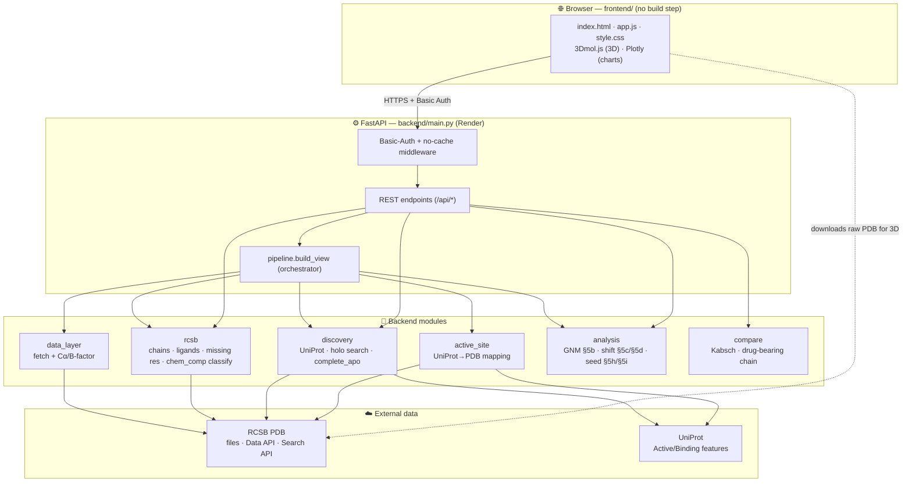
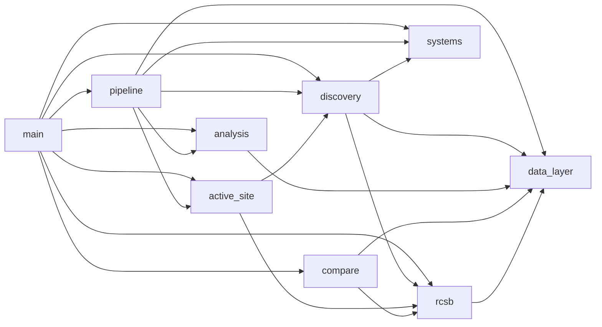
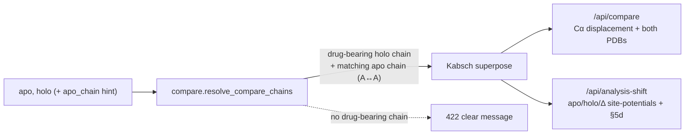

# Architecture — Quantum Allosteric Scanner

A diagram-first view of how the software fits together. Companion to
[`SOFTWARE.md`](SOFTWARE.md) (the detailed reference). **Update this step by step** as the
system evolves — see the [Change log](#change-log) at the bottom.

- Live: https://quantum-allosteric-scanner.onrender.com · login `jury` / `QAS@CC`
- Phase: **① Data foundation (current)** → ② Quantum solving → ③ Literature comparison

---

## 1. System overview



---

## 2. Backend module dependencies



`data_layer` and `systems` are the leaves (no internal deps). `main` wires everything and
serves the frontend. No module imports `main` (avoids cycles).

---

## 3. Request flow — `POST /api/load`

```mermaid
sequenceDiagram
  participant B as Browser
  participant M as main (auth)
  participant P as pipeline.build_view
  participant D as discovery / data_layer
  participant A as active_site
  participant G as analysis (GNM)
  B->>M: POST /api/load {pdb_id, complete?, holo_pdb?}
  M->>P: build_view(...)
  alt complete = true
    P->>D: complete_apo (Kabsch-align holo, fill missing)
  else
    P->>D: load_structure (Cα + B-factor)
  end
  P->>A: detect_active_site (UniProt → PDB numbering)
  P->>G: site_potentials (GNM V_B..V_M + enrichment)
  P-->>M: residues + active_site + analysis + completion + pdb_text
  M-->>B: JSON
  B->>B: 3Dmol downloads raw PDB; overlays filled/active/drug; Plotly charts
```

The browser fetches the **raw PDB from RCSB** for the cartoon, and overlays the per-residue
annotations from the API (active site, filled residues, drug sites). `pdb_text` is the
export of the *visualized* structure (filled coords, modeled residues flagged).

---

## 4. Comparison flow — `GET /api/compare` & `/api/analysis-shift`



---

## 5. Directory layout

```
Quantum_allosteric-scanner/
├── backend/
│   ├── main.py          FastAPI app, middleware, endpoints, serves frontend
│   ├── pipeline.py      build_view orchestrator + structure_to_pdb_text
│   ├── data_layer.py    RCSB fetch + Cα/B-factor extraction
│   ├── rcsb.py          structure intel + chem_comp ligand classifier
│   ├── discovery.py     UniProt + holo search + complete_apo
│   ├── active_site.py   UniProt→PDB active-site detection
│   ├── analysis.py      GNM site potentials (§5b/§5c/§5d)
│   ├── compare.py       Kabsch superpose + drug-bearing-chain resolution
│   └── systems.py       benchmark target metadata
├── frontend/            index.html · app.js · style.css
├── render.yaml          Render Blueprint (deploy)
├── requirements.txt
├── SOFTWARE.md          full reference (API, science, testing)
└── ARCHITECTURE.md      this file
```

---

## 5b. Feature intent map

Every backend endpoint and frontend control, mapped to its purpose and challenge-rubric/
roadmap linkage (or flagged as unclear): [`.ai/reviews/PRODUCT_INTENT_MAP.md`](.ai/reviews/PRODUCT_INTENT_MAP.md) (TASK-0020).

---

## 6. Where the next phases plug in

- **② Quantum solving** — a new `backend/quantum.py` (CTQW on the residue contact network
  seeded from the active site) + `/api/scan`; the frontend gains a "② Quantum Solving" panel.
  It consumes the **completed apo** + active site that phase ① already produces.
- **③ Literature comparison** — an LLM + retrieval service that takes the structured
  results JSON and compares predicted allosteric residues against published sites.

---

## Change log

Newest first; one line per change, **dated + signed** so teammates can see what changed
when: `- YYYY-MM-DD · <name> · <summary>`. See [COLLABORATION.md](COLLABORATION.md).

- 2026-08-03 · Implementer B · Flagged (not fixed) a genotype error propagating out of the research register into the live app: `backend/systems.py`'s `KRAS_G12C` entry ships `apo="4OBE"` with `covalent_anchor=12`/`top5_full_named=["CYS12",...]`, but 4OBE is wild-type KRAS (chain A residue 12 is GLY, re-verified directly), not G12C — found by `__WORK_IN_PROGRESS__`'s TASK-0155 and independently re-confirmed. Added a dated code comment recording the apo/label mismatch as a real, unresolved inconsistency (not a defensible modelling choice as shipped); no apo swap, no response-shape change — that is a register-wide re-run, explicitly out of scope here. `SOFTWARE.md`'s benchmark table and `__WORK_IN_PROGRESS__/config/targets.yaml`/`COMPETENCE_MAP.md` carry the same flag (TASK-0192).
- 2026-06-28 · Oussema · Fix real-structures graph: it intersected residues across ALL frames (smaller node set → fewer edges → fragmented graph) and could read a different cutoff. Now `morph_frames` builds on the **canonical apo∩holo set** (identical nodes/edges/cutoff to the connectivity graph); intermediates only reposition residues they contain, missing ones follow the apo→holo line (returns `coverage[]`). Frontend sends `LAST.conn.cutoff` so both modes match exactly.
- 2026-06-28 · Oussema · 3D graph: the **Region selector now drives the real-structures animation too** — changing X/Y region re-filters the real keyframes (by residue number) so the graph animates only the selected region; cached as `LAST.frames`, applied via `subsetFrames` in `applyConnRegion`; motion-mode toggle re-renders on the current region.
- 2026-06-28 · Oussema · 3D graph animation real-structures mode now **auto-discovers** intermediates: the user only picks **how many frames** (the protein is already chosen). `discovery.same_protein_entries` (UniProt→RCSB) + `analysis._auto_intermediates` order other PDB structures of the same protein along apo→holo by a best-fit-RMSD progress coordinate and pick n−2 evenly. `/api/morph-frames` param is now `n_frames` (2–8), not manual ids; UI is a Frames count, not an id box.
- 2026-06-28 · Oussema · 3D contact-graph animation: **real-structures mode**. New `analysis.morph_frames` + `GET /api/morph-frames` return Kabsch-aligned Cα keyframes `[apo, …intermediates, holo]` on the residue set shared by all. The graph morph generalized from a single apo→holo straight line to a path through K real keyframes; a "Motion" toggle (straight-line ↔ real structures) added under the graph. Linear mode unchanged.
- 2026-06-28 · Oussema · New `backend/rcsb_extract.py` — standalone RCSB extraction module for apo→holo work (fetch_structure / fetch_ligand / fetch_apo_holo / fetch_intermediates). Parses .cif via Biotite→gemmi→BioPython fallback, returns Cα coords + resnums/names/chains/B-factors + one-letter sequence, drug atoms, apo↔holo % identity (same-protein check), and an arbitrary-length ordered list of user-supplied intermediate structures (so the animation layer can later choose N real frames vs the current linear morph). General/robust (errors never raise). Not yet wired into the API. Added biotite/gemmi/requests to requirements.
- 2026-06-28 · Oussema · Seed-readiness made fully data-driven (no hardcoding), porting the corrected notebook §5h/§5i: size-invariant distal-reach *enrichment* (vs uniform spread) replaces fixed 0.05/0.15 cutoffs; apo→holo shift now uses RAW unit-fixed descriptors with a 2σ bootstrap noise floor (replaces fixed d_z); mechanism measured at the active site AND the structure-derived drug pocket, with orthosteric/allosteric auto-detected by geometry. New response fields: `topology`, `drug_active_sep`, `active_shift`, `pocket_shift`, `reach_shift`, `distal_enrich`. Card + help-box updated.
- 2026-06-28 · Oussema · Performance: keep-warm GitHub Actions cron pings `/api/health` every 10 min (no Render cold start) + in-memory cache of RCSB/UniProt JSON in `rcsb._get_json` (repeat loads & cutoff/param changes reuse the download). Raw PDB files were already disk-cached. Frontend: changing chains / "complete apo" now also reloads everything once a structure is loaded (cutoff/sitemode already did).
- 2026-06-28 · Oussema · Fix: selecting a benchmark target no longer auto-extracts — it only populates the inputs; loading happens on "Find & visualize".
- 2026-06-28 · Oussema · Quantum-seed readiness (notebook §5h/§5i): `analysis.quantum_seed_readiness` (is the active site a safe quantum-walk seed — per-residue degree/coupling/rigidity/modeled flags + average-mixing distal-reach → SAFE/PARTIAL/RISKY) + `seed_readiness_shift` (apo vs holo → drug activation/deactivation hypothesis). Returned on `/api/connectivity-change` as `seed_readiness`; rendered as a card in the connectivity panel just before the 3D contact-graph animation.
- 2026-06-25 · Oussema · Connectivity-change panel: residue-region selector (X cols / Y rows = all / active site / drug site / custom interval) restricts all 3 matrices to the sub-block and the morph + 3D graph to the union subset.
- 2026-06-25 · Oussema · Connectivity-change panel: "how to read these values" guide (DDM / rewiring / ΔDCC / summary / morph interpretation).
- 2026-06-25 · Oussema · GNM panel: collapsible "how to read these values" guide (descriptor +/− meaning + Laplacian-spectrum interpretation).
- 2026-06-25 · Oussema · GNM analysis: permutation-significance on descriptor enrichment (p-value + red/grey bar) + contact-Laplacian spectrum histogram (`l_eigs`).
- 2026-06-25 · Oussema · Protein contact-graph animation upgraded from 2D (PCA projection) to interactive 3D (scatter3d, real Cα coords; drag-rotate while it morphs apo→holo).
- 2026-06-25 · Oussema · Fix 3D ligand labels: anchor each label to its own ligand copy's centroid (stable on zoom; labels duplicate ligands like KRAS's two GDPs correctly).
- 2026-06-25 · Oussema · Added COLLABORATION.md (team workflow) + dated change-log convention.
- Added CLAUDE.md + AGENTS.md (agent onboarding entry points) — a new session/agent reads these to get full project context; kept in sync with ARCHITECTURE.md + SOFTWARE.md.
- `/api/connectivity-change` (§8d DDM · rewiring · ΔDCC + morph coords) + connectivity-change panel with JS morph animation.
- `/api/drug-site` (holo drug-binding residues) — overlays where the drug binds onto the apo GNM view.
- Active-site source toggle: `active_site_mode` (benchmark|auto) on `/api/load` + toolbar select — validate UniProt detection against the curated benchmark values.
- GNM coupling cutoff (Å) exposed as a variable: `/api/load` + `/api/analysis-shift` `cutoff` param (default 8, clamped 5–14) + toolbar input.
- Ligand classifier moved into `rcsb.py` (chem_comp-driven); `pipeline` emits `pdb_text`.
- `compare.resolve_compare_chains` added (drug-bearing chain) — used by compare + shift.
- `analysis.py` gained `site_potential_shift` (§5c/§5d).
- Pivoted to data-foundation: removed quantum/validation modules (recoverable in git history).
- Initial build: data_layer · rcsb · discovery · active_site · analysis · compare · pipeline · main.
