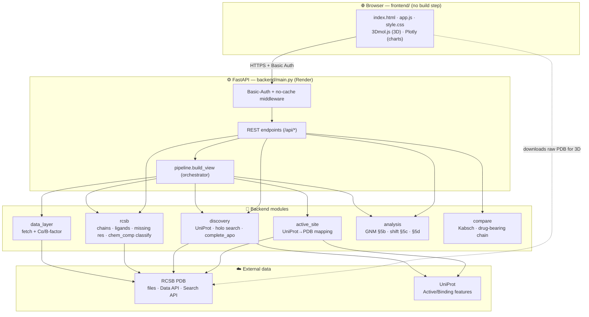
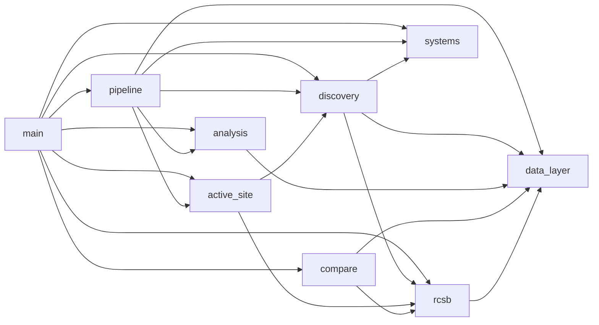
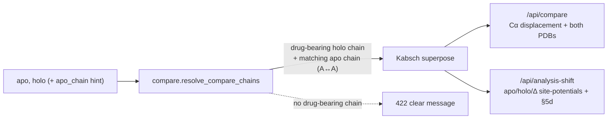

# Architecture — Quantum Allosteric Scanner

A diagram-first view of how the software fits together. Companion to
[`SOFTWARE.md`](SOFTWARE.md) (the detailed reference). **Update this step by step** as the
system evolves — see the [Change log](#change-log) at the bottom.

- Live: https://quantum-allosteric-scanner.onrender.com · login `jury` / `QAS@CC`
- Phase: **① Data foundation (current)** → ② Quantum solving → ③ Literature comparison

---

## 1. System overview



---

## 2. Backend module dependencies



`data_layer` and `systems` are the leaves (no internal deps). `main` wires everything and
serves the frontend. No module imports `main` (avoids cycles).

---

## 3. Request flow — `POST /api/load`

```mermaid
sequenceDiagram
  participant B as Browser
  participant M as main (auth)
  participant P as pipeline.build_view
  participant D as discovery / data_layer
  participant A as active_site
  participant G as analysis (GNM)
  B->>M: POST /api/load {pdb_id, complete?, holo_pdb?}
  M->>P: build_view(...)
  alt complete = true
    P->>D: complete_apo (Kabsch-align holo, fill missing)
  else
    P->>D: load_structure (Cα + B-factor)
  end
  P->>A: detect_active_site (UniProt → PDB numbering)
  P->>G: site_potentials (GNM V_B..V_M + enrichment)
  P-->>M: residues + active_site + analysis + completion + pdb_text
  M-->>B: JSON
  B->>B: 3Dmol downloads raw PDB; overlays filled/active/drug; Plotly charts
```

The browser fetches the **raw PDB from RCSB** for the cartoon, and overlays the per-residue
annotations from the API (active site, filled residues, drug sites). `pdb_text` is the
export of the *visualized* structure (filled coords, modeled residues flagged).

---

## 4. Comparison flow — `GET /api/compare` & `/api/analysis-shift`



---

## 5. Directory layout

```
Quantum_allosteric-scanner/
├── backend/
│   ├── main.py          FastAPI app, middleware, endpoints, serves frontend
│   ├── pipeline.py      build_view orchestrator + structure_to_pdb_text
│   ├── data_layer.py    RCSB fetch + Cα/B-factor extraction
│   ├── rcsb.py          structure intel + chem_comp ligand classifier
│   ├── discovery.py     UniProt + holo search + complete_apo
│   ├── active_site.py   UniProt→PDB active-site detection
│   ├── analysis.py      GNM site potentials (§5b/§5c/§5d)
│   ├── compare.py       Kabsch superpose + drug-bearing-chain resolution
│   └── systems.py       benchmark target metadata
├── frontend/            index.html · app.js · style.css
├── render.yaml          Render Blueprint (deploy)
├── requirements.txt
├── SOFTWARE.md          full reference (API, science, testing)
└── ARCHITECTURE.md      this file
```

---

## 6. Where the next phases plug in

- **② Quantum solving** — a new `backend/quantum.py` (CTQW on the residue contact network
  seeded from the active site) + `/api/scan`; the frontend gains a "② Quantum Solving" panel.
  It consumes the **completed apo** + active site that phase ① already produces.
- **③ Literature comparison** — an LLM + retrieval service that takes the structured
  results JSON and compares predicted allosteric residues against published sites.

---

## Change log

Newest first; one line per change, **dated + signed** so teammates can see what changed
when: `- YYYY-MM-DD · <name> · <summary>`. See [COLLABORATION.md](COLLABORATION.md).

- 2026-06-25 · Oussema · Fix 3D ligand labels: anchor each label to its own ligand copy's centroid (stable on zoom; labels duplicate ligands like KRAS's two GDPs correctly).
- 2026-06-25 · Oussema · Added COLLABORATION.md (team workflow) + dated change-log convention.
- Added CLAUDE.md + AGENTS.md (agent onboarding entry points) — a new session/agent reads these to get full project context; kept in sync with ARCHITECTURE.md + SOFTWARE.md.
- `/api/connectivity-change` (§8d DDM · rewiring · ΔDCC + morph coords) + connectivity-change panel with JS morph animation.
- `/api/drug-site` (holo drug-binding residues) — overlays where the drug binds onto the apo GNM view.
- Active-site source toggle: `active_site_mode` (benchmark|auto) on `/api/load` + toolbar select — validate UniProt detection against the curated benchmark values.
- GNM coupling cutoff (Å) exposed as a variable: `/api/load` + `/api/analysis-shift` `cutoff` param (default 8, clamped 5–14) + toolbar input.
- Ligand classifier moved into `rcsb.py` (chem_comp-driven); `pipeline` emits `pdb_text`.
- `compare.resolve_compare_chains` added (drug-bearing chain) — used by compare + shift.
- `analysis.py` gained `site_potential_shift` (§5c/§5d).
- Pivoted to data-foundation: removed quantum/validation modules (recoverable in git history).
- Initial build: data_layer · rcsb · discovery · active_site · analysis · compare · pipeline · main.
